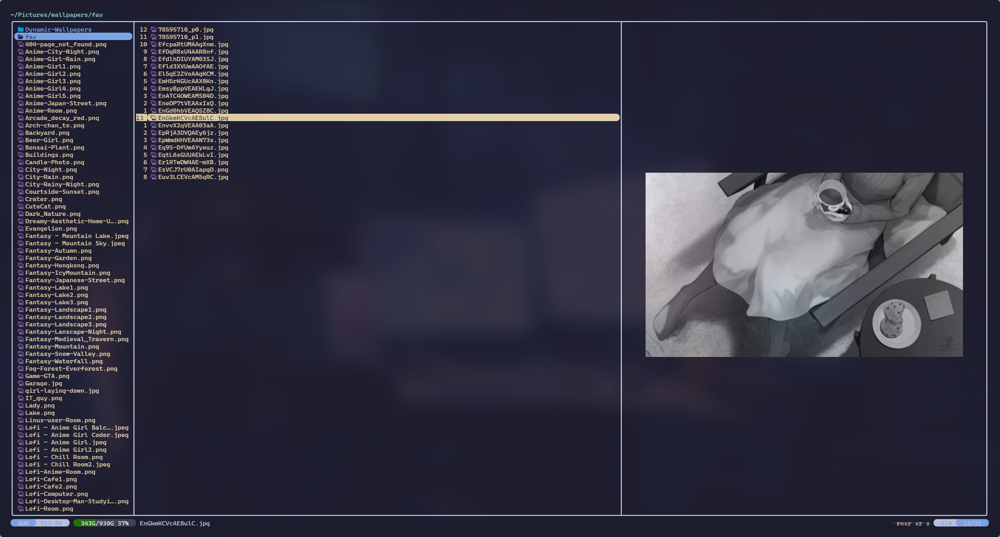
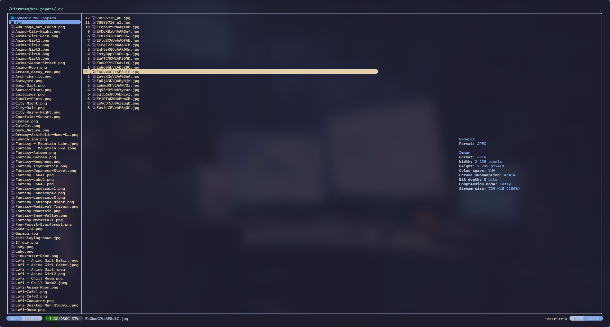

# center-media.yazi

Centered media previews for [Yazi](https://github.com/sxyazi/yazi): the image
horizontally, the image and its metadata as one block vertically, and the
metadata block horizontally.

The plugin comes with its own media previewer. It shows the file's `mediainfo`
output under a picture of it: the image itself, a frame of a video, the cover
art of an audio file or the artwork of an Adobe file. Subtitles get the
metadata alone. That previewer started out as
[mediainfo.yazi](https://github.com/boydaihungst/mediainfo.yazi), which is no
longer maintained, and is now maintained here as part of this plugin. Any other
previewer that draws through `ya.image_show()` can be centered instead.

<table>
  <tr>
    <th width="33%">Default</th>
    <th width="33%">Metadata hidden</th>
    <th width="33%">Image hidden</th>
  </tr>
  <tr>
    <td></td>
    <td></td>
    <td></td>
  </tr>
</table>

The image and the metadata can each be switched off while Yazi runs, see
[Keymaps](#keymaps).

## Why this exists

Yazi has no alignment setting for previews. `ya.image_show(url, rect)` always
anchors the image to the top-left corner of the rect it is given, and only
returns the size it ended up drawing at, which is too late to position anything
with. The open feature request is
[sxyazi/yazi#1141](https://github.com/sxyazi/yazi/issues/1141).

So this plugin works the rendered size out before drawing:

1. `ya.image_info()` gives the cached image's size in pixels.
2. The size of one terminal cell in pixels is learned at runtime, from the first
   draw the rect did not clip. There the image kept its cached pixel size, so
   pixels divided by cells is the size of one cell. It is kept in Yazi's sync
   state and reused for every image after that.
3. The predicted size gives the offsets, the image is drawn there, and the rect
   `ya.image_show()` returns is compared against the prediction. If it was off by
   more than one cell, the image is redrawn once at the corrected offset.

The first image of a session is drawn before any cell size is known, so it is
drawn once at the top-left and immediately redrawn centered. Every image after
that is positioned correctly on the first draw.

To keep the metadata under the image, the plugin reports the image to the
previewer as if it had started at the top of the rect, so the previewer lays its
metadata out directly below the shifted image. The gap that leaves at the bottom
equals the gap added at the top, which is what centers the two together.

## Requirements

- Yazi 26.9.1 or newer
- [mediainfo](https://mediaarea.net/en/MediaInfo) for the metadata
- [FFmpeg](https://ffmpeg.org), including `ffprobe`, for video thumbnails and
  audio cover art
- [ImageMagick](https://imagemagick.org) for HEIC, AVIF, JPEG XL, TIFF and Canon
  raw images, for Illustrator, Photoshop and EPS files (with
  [Ghostscript](https://ghostscript.com) for Illustrator and EPS), and for the
  blank image shown in place of missing audio cover art
- [resvg](https://github.com/linebender/resvg) for SVG images

Without `mediainfo`, files go to the previewer Yazi itself would have used, so
images, video and PDFs are still previewed and centered, just without metadata.
Yazi has no previewer for audio, so audio keeps this one: the cover art, with a
two-line note under it saying that `mediainfo` could not be started. Whether
`mediainfo` is installed is checked once per session, so restart Yazi after
installing it.

Any image protocol Yazi supports works, including its fallbacks, because the
geometry is read back from Yazi rather than assumed.

## Installation

```sh
ya pkg add ENEmyr/center-media
```

### Coming from mediainfo.yazi

This includes earlier versions of center-media, which wrapped mediainfo.yazi:
once center-media has its own previewer, the mediainfo.yazi setup and keymaps
no longer reach it. The previewer is the one from mediainfo.yazi, so moving
over is a matter of renaming:

1. Remove the old plugin with `ya pkg delete boydaihungst/mediainfo`.
2. In `yazi.toml`, change `run = "mediainfo"` to `run = "center-media"` in both
   the previewers and the preloaders. Arguments such as `--no-metadata` stay as
   they are.
3. In `init.lua`, move the options of `require("mediainfo"):setup()` into
   `require("center-media"):setup()`.
4. In `keymap.toml`, change `plugin mediainfo --` to `plugin center-media --`.

The cached metadata is stored the same way as before, so the existing cache
keeps working. One default differs: audio shows only the `General` and `Audio`
sections, described under [Options](#options).

## Usage

Point the previewers and preloaders for media files at this plugin. Give both
the same rules and arguments, so that the preloader prepares what the previewer
is going to show:

```toml
[[plugin.prepend_previewers]]
mime = "{audio,video,image}/*"
run  = "center-media"

[[plugin.prepend_preloaders]]
mime = "{audio,video,image}/*"
run  = "center-media"
```

Subtitles and Adobe files are previewed too once they are routed here. Some
Illustrator files are detected as `application/pdf`, which is why the extension
rule is there as well:

```toml
[[plugin.prepend_previewers]]
mime = "application/{subrip,postscript,illustrator,dvb.ait,vnd.adobe.illustrator,eps}"
run  = "center-media"

[[plugin.prepend_previewers]]
url = "*.{ai,eps,ait}"
run = "center-media"

[[plugin.prepend_preloaders]]
mime = "application/{subrip,postscript,illustrator,dvb.ait,vnd.adobe.illustrator,eps}"
run  = "center-media"

[[plugin.prepend_preloaders]]
url = "*.{ai,eps,ait}"
run = "center-media"
```

Any other format [mediainfo supports](https://mediaarea.net/en/MediaInfo/Support/Formats)
can be added the same way. Yazi's spotter (`<Tab>` by default) shows a file's
MIME type.

Two arguments trim the preview: `--no-metadata` shows only the image, and
`--no-preview` shows only the metadata. Give them to the previewer and the
preloader alike:

```toml
[[plugin.prepend_previewers]]
mime = "video/*"
run  = "center-media --no-preview"

[[plugin.prepend_preloaders]]
mime = "video/*"
run  = "center-media --no-preview"
```

### Options

`setup` is optional. These are the defaults:

```lua
require("center-media"):setup({
  -- Centering
  target     = "mediainfo", -- previewer to center; "mediainfo" is the bundled one
  horizontal = true,        -- center the image left to right
  vertical   = true,        -- center image and metadata together, top to bottom
                            -- (the metadata alone when there is no image)
  text       = "block",     -- "block", "center" or "off"

  -- Metadata shown by the bundled previewer
  sections = {
    audio = { "General", "Audio" },
  },
  skip_labels = {
    "Complete name",
    "CompleteName_Last",
    "Unique ID",
    "File size",
    "Format/Info",
    "Codec ID/Info",
    "MD5 of the unencoded content",
  },
  skip_section_labels = {},
})
```

`text` picks how the metadata is centered:

- `block` keeps every line left-aligned and centers the block as a whole. A
  block as wide as the pane, which happens as soon as one metadata line is long,
  stays where it is.
- `center` centers each line on its own. A line wider than the pane then loses
  its beginning as well as its end, so prefer `block` unless the metadata is
  short.
- `off` leaves the metadata alone and centers only the image.

`sections` picks which sections of the `mediainfo` output to show, by the
file's MIME top-level type (`audio`, `video`, `image` and so on). A type that is
not listed shows every section. The default shows only `General` and `Audio`
for audio files, because the `Image` section there describes the cover art,
which is already on screen as the preview image. For the same reason, audio
with its sections picked also drops the `Cover` lines under `General`. Section
names are written as `mediainfo` prints them, and numbered ones such as
`Audio #2` match their base name. Setting `sections` replaces the default table
as a whole, and `sections = false` shows every section of every file.
Audiobooks keep their chapter list with `audio = { "General", "Audio", "Menu" }`.

The type is the one Yazi detects, which is not always the obvious one. Yazi
may, for example, report Matroska audio (`.mka`) or WMA files as `video/*`,
and those then show every section.

`skip_labels` hides the lines with these labels, the part before the colon.
Setting it replaces the default list, and `skip_labels = false` hides nothing.

`skip_section_labels` hides only the heading line of the sections named, for
example `{ "General" }`, and keeps their content. Use `sections` to drop a whole
section.

A previewer argument overrides `target`, so another previewer can be centered
without a second copy of the plugin:

```toml
[[plugin.prepend_previewers]]
mime = "font/*"
run  = "center-media font"
```

Whether that looks right depends on the previewer. One that deliberately parks
its image in a corner will have it centered in that corner instead. Scrolling
always goes to `target`, because Yazi does not pass a previewer's arguments on
to its seek. The `sections` and `skip_*` options only apply to the bundled
previewer.

### Keymaps

These actions switch the metadata and the image on and off while Yazi runs.
They apply to every file until `reset`, which goes back to what `yazi.toml`
says:

```toml
[mgr]
prepend_keymap = [
  { on = "<F3>", run = "plugin center-media -- toggle-metadata", desc = "Toggle media metadata" },
  { on = "<F4>", run = "plugin center-media -- toggle-preview", desc = "Toggle media image" },
  { on = "<F5>", run = "plugin center-media -- reset", desc = "Reset media preview" },
]
```

The actions are `toggle-metadata`, `toggle-preview`, `hide-metadata`,
`hide-preview`, `show-metadata`, `show-preview` and `reset`. Several can be run
at once as flags, as in `plugin center-media -- --show-preview --hide-metadata`.

Yazi's seek keys (`J` and `K` by default) scroll the metadata. For a video they
also move the thumbnail through the video, and for an audio or Adobe file with
several pictures or layers, scrolling past the end of the metadata steps
through them.

### Theme

The metadata uses the styles of Yazi's spotter, so changing them in
`theme.toml` changes the spotter as well:

```toml
[spot]
title   = { fg = "green" } # section headings such as General and Audio
tbl_col = { fg = "blue" }  # values
```

### Large files

Big Illustrator or Photoshop files may need more memory than Yazi allows image
tasks by default. If they show no image, raise the limit in `yazi.toml`:

```toml
[tasks]
image_alloc = 1073741824 # 1 GiB
```

## Limitations

- Only previews that go through this plugin are centered. Other previewers,
  including ones that draw images, are left alone.
- When the metadata is taller than half the pane, the previewer is already
  clipping it, and the vertical offset takes a few more lines off the bottom.
- Changing the terminal font size invalidates the learned cell size. The next
  draw that is not clipped by the pane learns it again; until then images are
  drawn twice.
- Scrolling far past the end of the metadata in quick succession can leave the
  metadata showing from the top. Scrolling back up recovers it.

## Troubleshooting

`YAZI_LOG=debug yazi` logs one line per draw with the rect, the predicted size,
the drawn size and the offset used:

```
center-media: rect 74x29, predicted 31x16, drawn 31x16, offset 21,6
```

If predicted and drawn keep disagreeing, the cell size is not being learned,
which happens when every image is large enough to fill the pane. Centering still
works in that case, it just costs a second draw.

If `mediainfo` was installed while Yazi was running, restart Yazi to get the
metadata.

## Development

The metadata handling has tests that run outside Yazi, against stubs of its Lua
API and real `mediainfo` output:

```sh
lua5.4 tests/metadata.lua
```

## Credits

The media previewer is derived from
[mediainfo.yazi](https://github.com/boydaihungst/mediainfo.yazi) by Huy Hoang
(boydaihungst), which builds on earlier work by Lauri Niskanen. Both are
credited in [LICENSE](LICENSE), as the MIT License requires.

## License

MIT. See [LICENSE](LICENSE).
