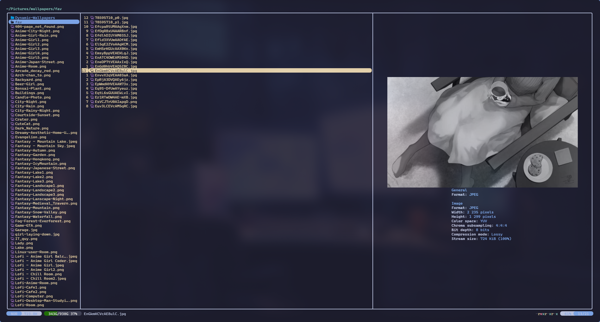

# center-media.yazi

Center media previews in [Yazi](https://github.com/sxyazi/yazi): the image
horizontally, the image and its metadata as one block vertically, and the
metadata block horizontally.

This is a wrapper, not a previewer of its own. It delegates to another previewer
([mediainfo.yazi](https://github.com/boydaihungst/mediainfo.yazi) by default) and
repositions what that previewer draws.

<p align="center">
  
</p>

## Why this exists

Yazi has no alignment setting for previews. `ya.image_show(url, rect)` always
anchors the image to the top-left corner of the rect it is given, and only
returns the size it ended up drawing at, which is too late to position anything
with. The open feature request is
[sxyazi/yazi#1141](https://github.com/sxyazi/yazi/issues/1141).

So this plugin works the rendered size out before drawing:

1. `ya.image_info()` gives the cached image's size in pixels.
2. The size of one terminal cell in pixels is learned at runtime, from the first
   draw the rect did not clip. There the image kept its cached pixel size, so
   pixels divided by cells is the size of one cell. It is kept in Yazi's sync
   state and reused for every image after that.
3. The predicted size gives the offsets, the image is drawn there, and the rect
   `ya.image_show()` returns is compared against the prediction. If it was off by
   more than one cell, the image is redrawn once at the corrected offset.

The first image of a session is drawn before any cell size is known, so it is
drawn once at the top-left and immediately redrawn centered. Every image after
that is positioned correctly on the first draw.

To keep the metadata under the image, the wrapper reports the image as if it had
started at the top of the rect, so the wrapped previewer lays its metadata out
directly below the shifted image. The gap that leaves at the bottom equals the
gap added at the top, which is what centers the two together.

## Requirements

- Yazi 26.9.1 or newer
- [mediainfo.yazi](https://github.com/boydaihungst/mediainfo.yazi), recommended.
  It is the default target, and the reason there is any metadata under the image
  to center in the first place. It needs the `mediainfo` CLI and ImageMagick.

Without it the plugin still works. The previewer Yazi itself would have used is
used instead, following Yazi's own rules (`image`, `magick`, `svg`, `video`,
`pdf`), and its image is centered just the same. You get a centered image and
nothing under it, quietly: there is nothing to configure and nothing to dismiss.

Any image protocol Yazi supports works, including its fallbacks, because the
geometry is read back from Yazi rather than assumed.

## Installation

This plugin wraps a previewer rather than being one, so install
[mediainfo.yazi](https://github.com/boydaihungst/mediainfo.yazi) alongside it:

```sh
ya pkg add boydaihungst/mediainfo
ya pkg add ENEmyr/center-media
```

The first line is a recommendation rather than a hard requirement. Skip it if
all you want is Yazi's own preview, centered.

## Usage

Point the previewers and preloaders that should be centered at this plugin
instead of at the previewer it wraps. Previewers and preloaders have to agree,
or the preview and the preloaded cache disagree about their arguments:

```toml
[[plugin.prepend_previewers]]
mime = "{video,image}/*"
run  = "center-media"

[[plugin.prepend_preloaders]]
mime = "{video,image}/*"
run  = "center-media"
```

`setup` is optional. These are the defaults:

```lua
require("center-media"):setup({
  target     = "mediainfo", -- previewer to wrap
  horizontal = true,        -- center the image left to right
  vertical   = true,        -- center image and metadata together, top to bottom
  text       = "block",     -- "block", "center" or "off"
})
```

`text` picks how the metadata is handled:

- `block` keeps every line left-aligned and centers the block as a whole. A
  block as wide as the pane, which happens as soon as one metadata line is long,
  stays where it is.
- `center` centers each line on its own. A line wider than the pane then loses
  its beginning as well as its end, so prefer `block` unless the metadata is
  short.
- `off` leaves the metadata alone and centers only the image.

A previewer argument overrides `target`, so a second previewer can be wrapped
without a second copy of the plugin. Anything that draws through
`ya.image_show()` can be wrapped this way:

```toml
[[plugin.prepend_previewers]]
mime = "audio/*"
run  = "center-media some-other-previewer"
```

Whether that looks right depends on the previewer. One that deliberately parks
its image in a corner will have it centered in that corner instead.

## Limitations

- Only the previewer this plugin wraps is affected. Other previewers, including
  ones that draw images, are left alone.
- A preview with no image, such as `mediainfo --no-preview`, gets its metadata
  centered horizontally but not vertically.
- When the metadata is taller than half the pane, the wrapped previewer is
  already clipping it, and the vertical offset takes a few more lines off the
  bottom.
- Changing the terminal font size invalidates the learned cell size. The next
  draw that is not clipped by the pane learns it again; until then images are
  drawn twice.

## Troubleshooting

`YAZI_LOG=debug yazi` logs one line per draw with the rect, the predicted size,
the drawn size and the offset used:

```
center-media: rect 74x29, predicted 31x16, drawn 31x16, offset 21,6
```

If predicted and drawn keep disagreeing, the cell size is not being learned,
which happens when every image is large enough to fill the pane. Centering still
works in that case, it just costs a second draw.

## Credits

[mediainfo.yazi](https://github.com/boydaihungst/mediainfo.yazi) by boydaihungst
is the default target and does all the real preview work. This plugin only moves
the result around.

## License

MIT. See [LICENSE](LICENSE).
